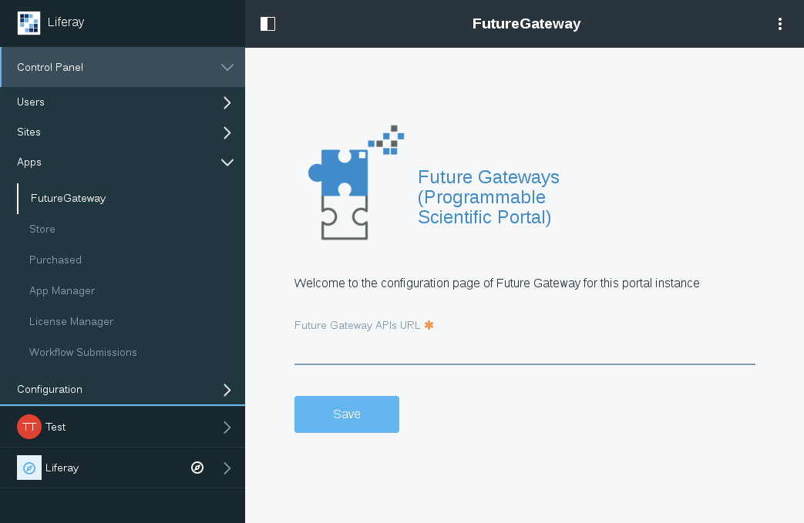
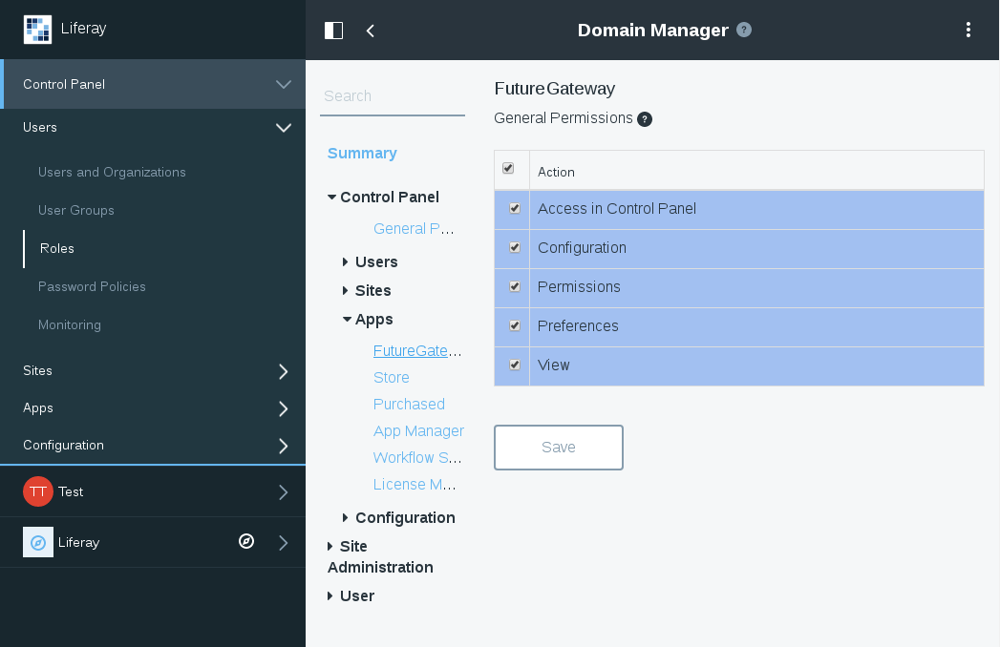
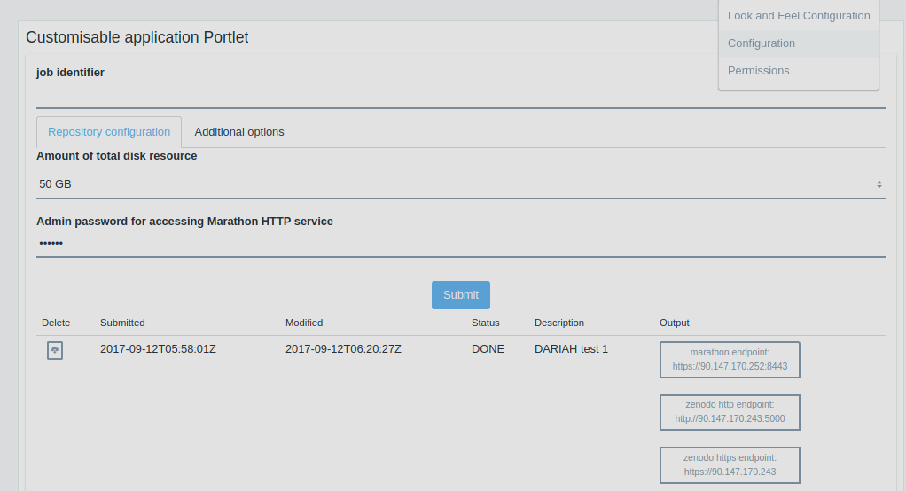
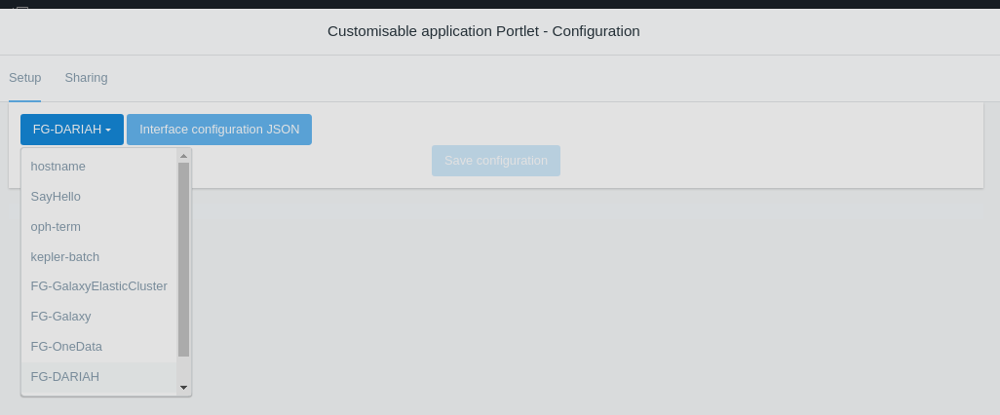
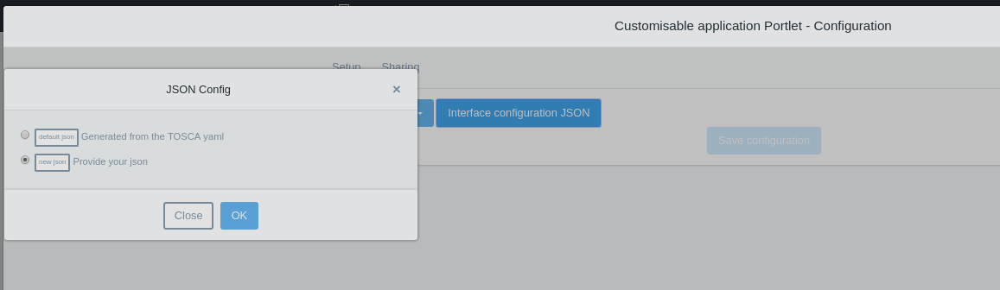

# Administration Guide

## IAM Authentication modules

To deploy the IAM Authentication modules and make available INDIGO-AAI in Liferay the portal administrator has to upload into the portal
the five jar modules included in the release:

- `com.liferay.login.authentication.iam.web-x.y.z.jar`,
- `com.liferay.portal.security.sso.iam-x.y.z.jar`,
- `com.liferay.portal.security.sso.iam.api-x.y.z.jar`,
- `com.liferay.portal.security.sso.iam.service-x.y.z.jar`,
- `com.liferay.portal.settings.authentication.iam.web-x.y.z.jar`.

The module upload page is available in `Liferay > Control Panel > Apps > App Manager`.

Some javascript in the modules could not load properly, to avoid problems configure Liferay with the property `javascript.fast.load=false`. 

After the modules are deployed the new IAM authentication configuration should be available in the control panel going
to `Liferay > Control Panel > Configuration > Instance Settings`, under the section *authentication*. The following picture
shows the configuration made with the IAM-Test instance:

To work with the test configuration it is enough to provide the application identifiers (id and secret) and
the URL of the well known OpenId Connect configuration. For the IAM test the URL is:
[https://iam-test.indigo-datacloud.eu/.well-known/openid-configuration](https://iam-test.indigo-datacloud.eu/.well-known/openid-configuration)
In order to get the identifiers the application has to be registered and this requires to specify the return URL after the
authentication. This has the following format:

    http(s)://<your_domain_name>/c/portal/iam_openidconnect

Administrator can require some extra scopes for the token. The default configuration requires only the scopes for the user
identification as requested by Liferay (name, mail and other attributes) and the refresh token.

Checking the enable check will make the authentication method available to the user.

Some application could require to access to reserved remote methods provided by the modules (to retrieve user token and/or
validate them). The access to these methods is possible only from authorised accounts.
The best way to provide the authorisation is to create a special role and assign this rule to the user or a group of users
associated with the applications requiring the permissions. The role has to enable the access
to this method. This can be configured going to the page `Liferay > Control Panel > Users > Roles`. In the page the administrator
can create a new role and then open the `Define Permissions` dialog which will show the authorisation for the iam related method
under the *Users and Organisations* group, as shown in the following picture:

Enabling the permissions for the `model.resource.com.liferay.portal.security.sso.iam`, among the *Resource Permissions*,
everyone with this role can access the remote methods.

Finally, to make the user subject and token visible to the owner among the account value the custom fields must be enabled. The fields
to enable are *Iamaccesstoken*, *Iamrefreshtoken* and 	*Iamuserid* and thes are available in the menu `Liferay > Control Panel > Custom Fields`
selecting the *User* resource. To make them visible select the permissions configuration and enable the view to the **User**. Ager the
users should find these three fields among their custom fields in the account configuration pages.

**NOTE:** the communication with IAM to generate tokens takes in account the timestamp of the messages. Hence, if the server time is not correct
token generation will fail and users will get an error page. To prevent problems during the token generation it is highly recommended to keep the
server time synchronised with a time server.

### Upgrade to a new release

To upgrade to a new release of the IAM authentication modules is enough to install the new module following the same procedure of the installation.
However, all previous configurations will remain untouched and applied to the new version (see note at the end).

## FutureGateway administration modules

To deploy the FutureGateway administration module the portal administrator has to upload into the portal
the jar module included in the release: `future.gateway.admin.portlet-1.0.0.jar`. The module upload page is
available in `Liferay > Control Panel > Apps > App Manager`. The FutureGateway administration module requires
the module `com.liferay.portal.security.sso.iam.service-x.y.z.jar` to be deployed in order to work.

After the module is deployed a new item in the control panel should be available:
to `Liferay > Control Panel > Apps > FutureGateway`. After the installation, the URL of the FutureGateway
service has to be provided, as shown in the following figure:

The admin panel is visible to the administrator but to interact with the FutureGateway it is requested to log-in to Liferay
using IAM in order to have a user token. To provide access to other user to the FutureGateway administration panel the administrator
has to create a new role going to the page `Liferay > Control Panel > Users > Roles`. In the page the administrator
can create a new role and then open the `Define Permissions` to provide the permissions for the panel. These can be found among the
control panel apps as show in the following figure:

Finally, the new role has to be assigned to the users responsible to manage the FutureGateway.

### Upgrade to a new release

To upgrade to a new release of the FutureGateway administration modules is enough to install the new module following the same procedure
of the installation.
However, all previous configurations will remain untouched and applied to the new version (see note at the end).

------------------------------

**NOTE:** in some Liferay versions upgraded modules are not removed but they will remain actives side by side with the new version.
A [bug](https://issues.liferay.com/browse/LPS-68275) has been reported in Liferay for the tested version. Therefore, before to
upgrade it is better to remove the previous version of LiferayIAM modules. This requires two steps:

* Access the `App Manager`, search for `iam` and remove the five related modules.
* Stop Liferay, remove the corresponding jar files from the `osgi/modules` folder in your installation and restart Liferay.

The modules should not be present anymore but the configuration is still stored so after the installation of the new modules the authentication
will return to work as before.

## FutureGateway customisable application module
To use the Customisable Application portlet, is needed to create and configure an application using the Admin Portlet. Then is possible to configure portlet using Configuration option.

It is possible to change application using first button with dropdown toggle. The list contains all installed applications on a given server instance.

**Interface configuration JSON** button opens **JSON Configuration** pop-up. This part of the configuration allows:

* To use parameters generated from the application TOSCA yaml  
* To use parameters list prepared by the user ([Syntax of json of parameters configuration](https://github.com/indigo-dc/LiferayPlugIns/tree/master/future-gateway-customisable-application-portlet))

To finish configuration is needed to confirm changes by pressing **Save configuration** button. The portlet should display all tasks for the chosen application and their current status.

## Kepler Status Portlet

This portlet can be installed by uploading the `kepler.status.portlet-VERSION.jar` using `Liferay > Control Panel > Apps > App Manager`. It uses configuration of FutureGateway administration panel (namely, the URL to the FutureGateway service) and there are not any additional steps required to configure Kepler Status Portlet. 
