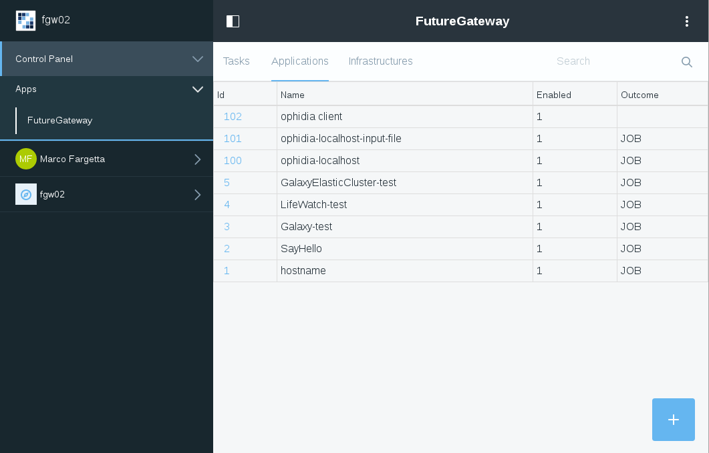
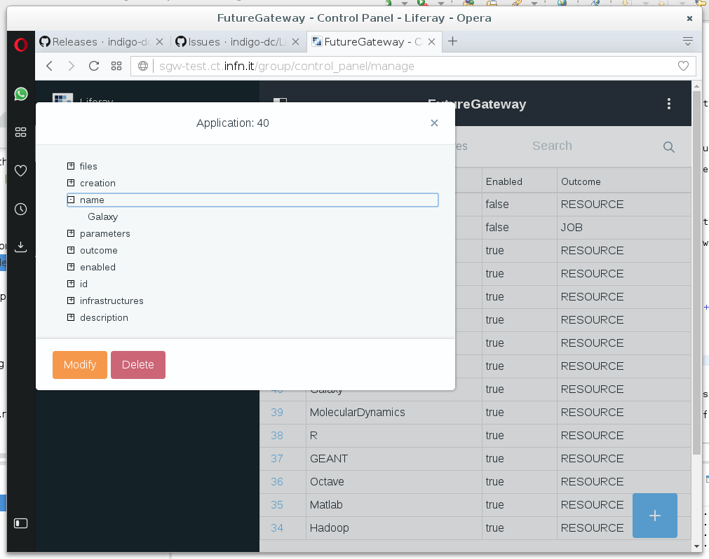

# User Guide

## IAM Authentication modules

When the IAM Authentication modules are deployed and properly configured the user interface change in few component. The login portlet
will include, among the other enabled protocols, the new *INDIGO AAI* authentication method, as shown in the following picture:

If a user clicks on *INDIGO AAI* a pop-up window is created with the IAM login page. After the login the pop-up page
is automatically closed and the user is authenticated in the portal.

When a new user try to access the portal, he/she has to provide the consensus to release the tokens to the Liferay
based portal. This request is performed twice: once for the access token and the other for the refresh token.
Following authentications will not require the user consensus. This will be requested again if different scopes are requested.

Finally, the user can verify the tokens released by IAM going to his/her personal account page. In the *My Account* page,
under the tab *Miscellaneous* there are the *Custom Fields* attributes. IAM tokens nad user subject are among the custom fields
as shown in the following picture:

## FutureGateway administration modules

The FutureGateway administration modules add a new panel in the control panel of Liferay at `Liferay > Control Panel > Apps > FutureGateway` which
is visible to the enabled user (a special role is requested to access the panel).

The panel presents a multi tab interface with three tabs for the main resources of the FutureGateway: *tasks*, *applications* and *infrastructures*.
In each tab a table with the available resources is shown, as shown in the following figure:

User can look at the resource details by clicking the id. This will open a modal window with an information tree containing all the resource details
and a button to delete the resource, although the user should be enabled in the FutureGateway to delete the resources. The modal windows is shown
in the following figure:

Finally, in the right bottom of the applications and infrastructures tab a button with a `+` sign open an insert page where the user can
add a new resource. The button will open a new page with a form, depending on the resource type, containing all the possible fields.

Currently, resource search, filter and modify is not supported but it will be added in future releases of the modules.
